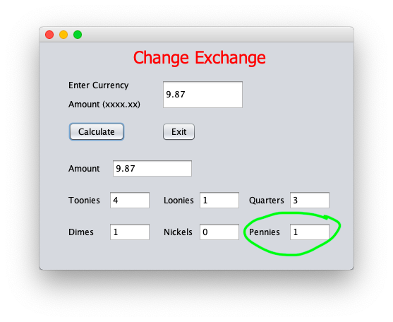

## Finite Data Representation

### Integer Overflow and Underflow

All computers use a fixed number of bits to represent data. This means that there are limits as to what integers a program can use.  

Java uses 64-bit data representation: the lowest integer it can store is -231 and the highest integer it can store is 231 - 1. You can use `Integer.MAX_VALUE` and `Integer.MIN_VALUE` to obtain these values.

When you try to compute a value beyond of this domain, it is called **integer overflow** (beyond `Integer.MAX_VALUE`) or **integer underflow** (beyond `Integer.MIN_VALUE`).

Fun fact: The Ariane 5 rocket launch in 1996 failed due to an integer overflow error. The rocket self-destructed and the damage cost approximately $370 million USD! Here is a video of the launch: [Ariane 5 Rocket Launch](https://www.youtube.com/watch?v=i67ycNPceHc).

> Exercise 16-4
> 
> What is the result when you run the following lines of code? What can you deduce about how Java treats integer overflow and underflow?
> 1. `System.out.println(Integer.MAX_VALUE + 1);`
> 2. `System.out.println(Integer.MIN_VALUE - 1);`
> 3. `System.out.println(Integer.MAX_VALUE + Integer.MAX_VALUE );`
> 4. `System.out.println(Integer.MIN_VALUE - Integer.MIN_VALUE);`
> 
> See solutions [here](../Exercise_Examples/Exercise-16-4.md).

### Precision of Double and Float

You may have noticed from the Change assignment that sometimes the result is slightly off even though the math checks out.

 

This inaccuracy is due to rounding errors when dividing using finite data representation. Only 93.1% of the values from 0.00 to 9.99 are actually accurate in the Change assignment, unless you modified the structure of the algorithm.

Inaccuracy caused by finite data representation is often frustrating. Be aware that if a calculation in any of your programs seems to be off, it might be that your algorithm may be fine and the Java simply can't accurately perform the calculation.

> Exercise 16-5
> 
> Create a program that uses a loop to determine which of the monetary values inclusively between 0.00 and 9.99 are inaccurate in the Change assignment.
> 
> See solution [here](../Exercise_Examples/Exercise-16-5.md).

